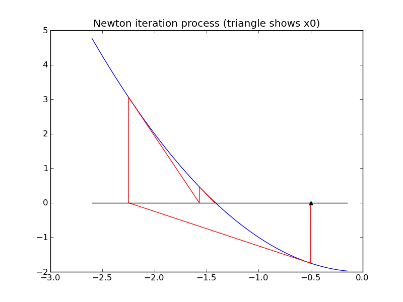
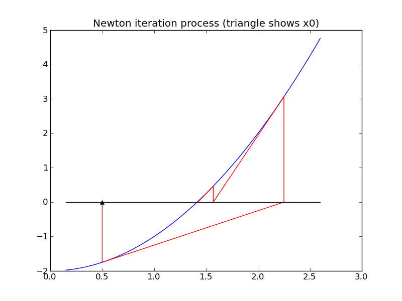

.. _special_functions:

=============================================================
Special functions
=============================================================

There are many functions that are used so frequently that they are given
special names. Familiar examples are sin, cos, sqrt, exp, log, etc.

Most programming languages have build-in (intrinsic) functions with these
same names that can be called to compute the value of the function for
arbitrary arguments.  

But "under the hood" these functions must be evaluated somehow.  The basic
arithmetic units of a computer are only capable of doing very basic
arithmetic in hardware: addition, subtraction, multiplication, and division.
Every other function must be *approximated* by applying some sequence of
arithmetic operations.

There are several ways this might be done....

Taylor series expansions
------------------------

A finite number of terms in the Taylor series expansion of a function gives
a polynomial that approximates the desired function.  Polynomials can be
evaluated at any point using basic arithmetic.

For example, the section on :ref:`fortran_taylor` discusses an
implementation of the Taylor series approximation to the exponential
function,

    :math:`exp(x) = 1 + x + \frac 1 2 x ^2 + \frac 1 6 x^3 + \cdots`

If this is truncated after the 4 terms shown, for example, we obtain a
polynomial of degree 3 that is easily evaluated at any point.

Some other Taylor series that can be used to approximate functions:

    :math:`sin(x) = x - \frac{1}{3!} x^3 + \frac 1 {5!} x^5 - \frac{1}{7!} x^7 + \cdots`

    :math:`cos(x) = 1 - \frac 1 2 x^2 + \frac{1}{4!} x^4 - \frac{1}{6!} x^6 + \cdots`

.. _special_newton:

Newton's method for the square root
-----------------------------------

One way to evaluate the square root function is to use *Newton's method*, a
general procedure for estimating a *zero* of a function :math:`f(x)`, i.e. a 
value :math:`x^*` for which :math:`f(x^*) = 0`.

The square root of any value :math:`a>0` is a zero of the function :math:`f(x)
= x^2 - a`.  (This function has two zeros, at :math:`\pm\sqrt{a}`.

Newton's method is based on taking a current estimate :math:`x_k` to
:math:`x^*` and (hopefully) improving it by setting 

    :math:`x_{k+1} = x_k - \delta_k`

The increment :math:`\delta_k` is determined by *linearizing* the function
:math:`f(x)` about the current esimate :math:`x_k` using only the linear
term in the Taylor series expansion.  This linear function :math:`G_k(x)` is

    :math:`G_k(x) = f(x_k) + f'(x_k)(x-x_k)`.

The next point :math:`x_{k+1}` is set to be the zero of this linear
function, which is trivial to find, and so

    :math:`\delta_k = f(x_k) / f'(x_k)`.

Geometrically, this means that we move along the tangent line to
:math:`f(x)` from the point :math:`(x_k,f(x_k))` to the point where this
line hits the x-axis, at :math:`(x_{k+1}, 0)`.  See the figures below.

There are several potential difficulties with this approach, e.g.

 * To get started we require an *initial guess* :math:`x_0`.

 * The method may converge to a zero from some starting points but not
   converge at all from others, or may converge to different zeros depending
   on where we start.  

For example, applying Newton's method to find a zero of :math:`f(x) = x^2-2`
coverges to :math:`\sqrt{2} \approx 1.414` if we start at :math:`x_0=0.5`,
but convergest o :math:`-\sqrt{2} \approx -1.414` if we start at
:math:`x_0=-0.5` as illustrated in the figures below.

An advantage of Newton's method is that it is guaranteed to converge to a
root provided the function :math:`f(x)` is smooth enough and the starting
guess :math:`x_0` is sufficiently close to the zero.  Moreover, in general
one usually observes *quadratic convergence*.  This means that once we get
close to the zero, the error roughly satisfies

    :math:`|x_{k+1} - x^*| \approx C|x_k-x^*|^2`

The error is roughly squared in each step.  In practice this means that once
you have 2 correct digits in the solution, the next few steps will produce
approximations with roughly 4, 8, and 16 correct digits (doubling each
time), and so it rapidly converges to full machine precision.

For example, the approximations to :math:`\sqrt{2}` generated by Newton's
method starting at :math:`x_0=0.5` are::

    k, x, f(x):   1    0.500000000000000E+00   -0.175000E+01
    k, x, f(x):   2    0.225000000000000E+01    0.306250E+01
    k, x, f(x):   3    0.156944444444444E+01    0.463156E+00
    k, x, f(x):   4    0.142189036381514E+01    0.217722E-01
    k, x, f(x):   5    0.141423428594007E+01    0.586155E-04
    k, x, f(x):   6    0.141421356252493E+01    0.429460E-09
    k, x, f(x):   7    0.141421356237310E+01    0.444089E-15

The last value is correct to all digits.

There are many other methods that have been developed for finding zeros of
functions, and a number of software packages that are designed to be more
robust than Newton's method (less likely to fail to converge) while still
converging very rapidly.

